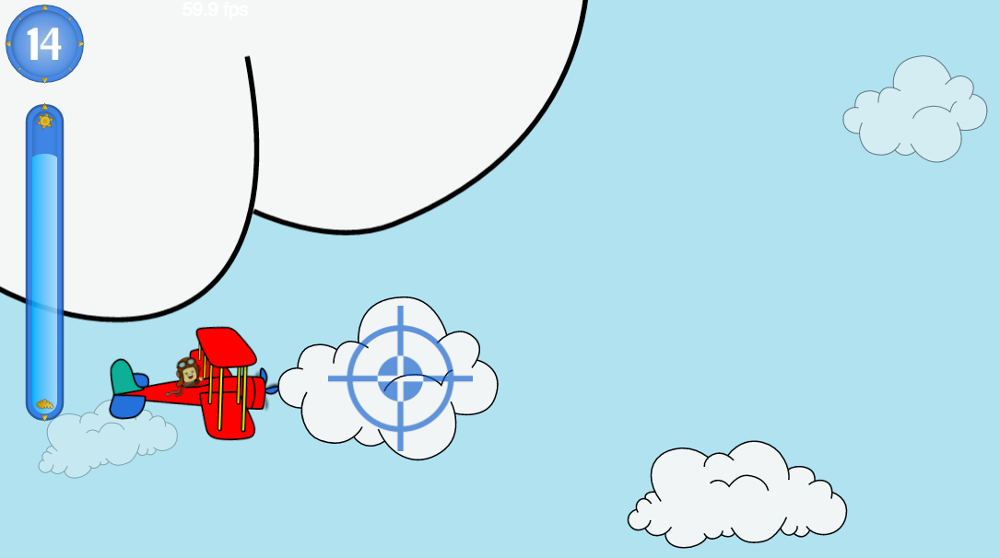

# Cloud Sweeper

Swoop your plane around to sweep away the clouds and keep the skies sunny!

<a href="https://rawgit.com/getify/cloud-sweeper/master/web/index.html">demo play</a>

## About

This is a web game designed to be played on a variety of devices. The graphics assets are SVG, but all rendering is done via full-page `<canvas>`. There are no frameworks or libraries, only vanilla JS.

The game play supports interaction via keyboard, mouse, touch, and pointer devices.

So far, it's been tested at a fairly smooth ~57-60fps performance on:

* OSX: Chrome, FF, Safari
* Android 5: Chrome, FF
* iOS 8, 9 (iPad3, iPhone5, iPhone6): Safari

Obviously, this is a work in progress. There's much to do. Help is definitely appreciated!

## App Model

Disclaimer: this may turn into a mobile app that may or may not eventually have some monetary model around it. Just be aware of that if you decide to participate in any way.

## License & Copyright

The materials herein are all (c) 2016 Kyle Simpson.

 This code, documentation, and artwork are all licensed under a <a rel="license" href="http://creativecommons.org/licenses/by-nc-sa/4.0/">Creative Commons Attribution-NonCommercial-ShareAlike 4.0 International License</a>.
